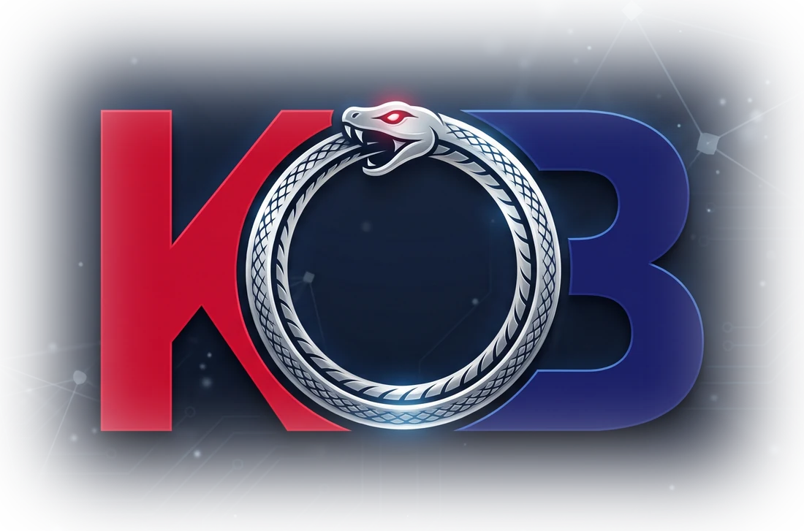
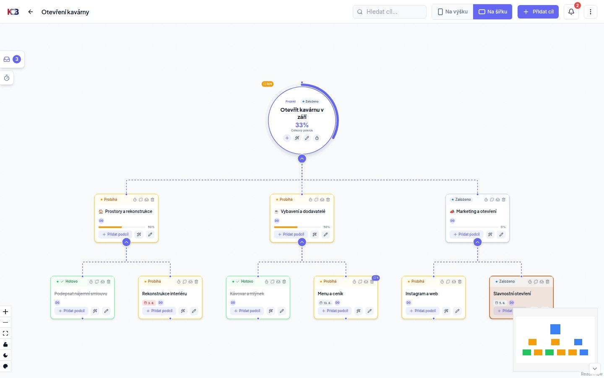
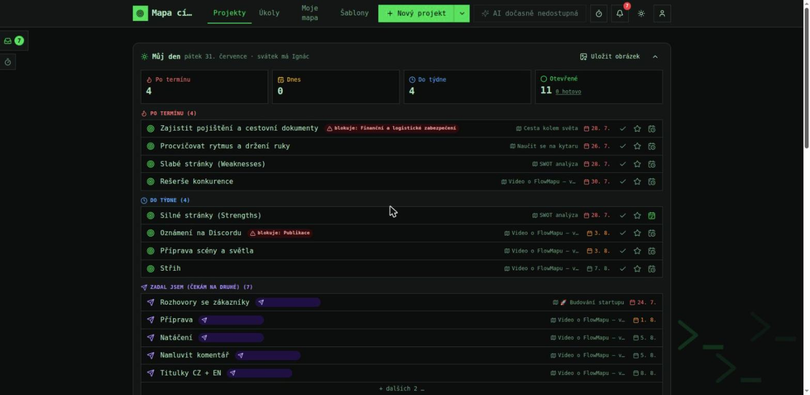
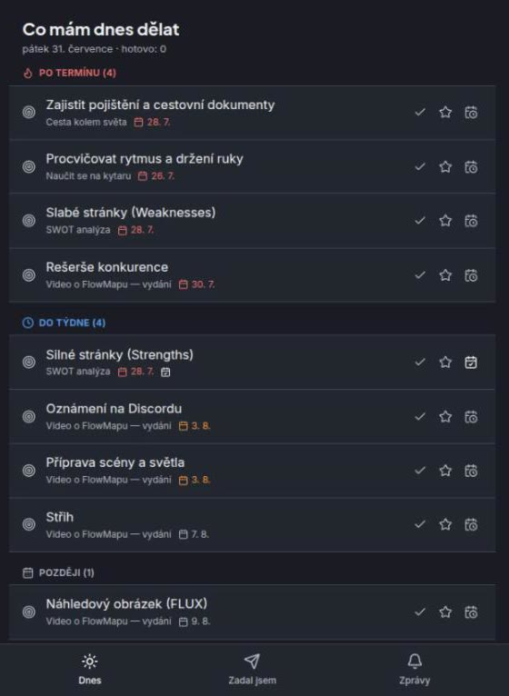
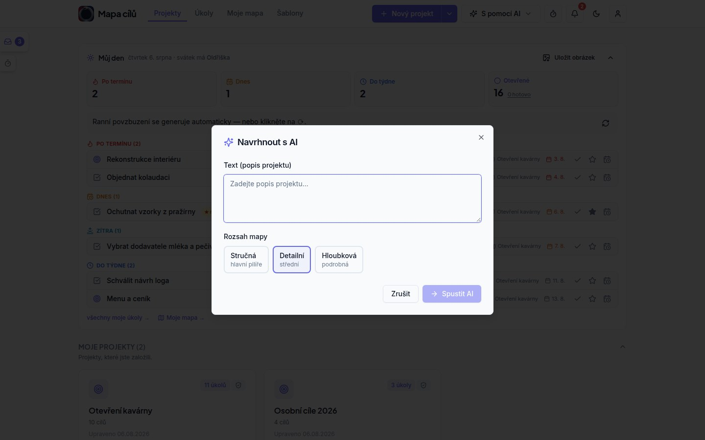
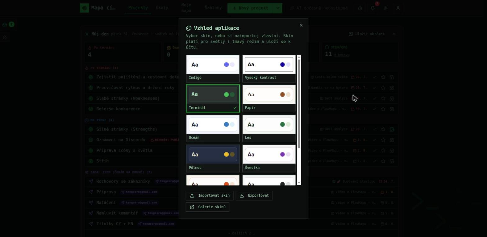

<p align="center">
  
</p>

<h1 align="center">killBottleneck</h1>

<p align="center">
  <a href="./README.md">English</a> | <strong>Čeština</strong><br>
  <a href="https://killbottleneck.cz">Web</a> ·
  <a href="https://killbottleneck.cz/navod/co-to-je">Dokumentace</a> ·
  <a href="./CHANGELOG.md">Změny</a> ·
  <a href="#licence--fair-code">Licence</a>
</p>

> 🧪 **Veřejná beta.** killBottleneck je funkčně kompletní a je v betě — cloudová
> i self-host verze, je to jedna a tatáž aplikace. Tady testujeme hlavně
> **self-host**: instalaci, provoz za reverse proxy, vlastní SMTP, aktualizace.
> Nainstalujte si ho (Rychlý start níže), klidně ho zkuste rozbít a napište nám,
> co se stalo: chyby → Issues, nápady → Discussions. v1.0 vyjde, až beta ztichne.

Grafické zobrazení projektů, firmy a procesů — mapy cílů, nad kterými pracují lidé i AI, **plně na vašem serveru: data neopouštějí firmu**. Otevřený kód v duchu open source, jen bez práva přeprodávat ho jako hostovanou službu — viz [Licence](#licence--fair-code).



**Nic odsud nevolá domů.** Ve výchozí instalaci neodešle server jediný požadavek a aplikace
nenačítá nic z cizí CDN — včetně fontů, ty se servírují z vaší vlastní instance. Všechno, co
by mohlo opustit vaši síť, si zapínáte **vy**:

| Odchozí požadavek | Kdy nastane | Jak vypnout |
| --- | --- | --- |
| GitHub Releases API | Kontrola verze, z **prohlížeče uživatele** — ne ze serveru | `KB_UPDATE_CHECK=0` |
| AI endpoint, který nastavíte | Jen s `KB_AI_PROVIDER` ≠ `none`; vaše ollama nebo endpoint, který si zvolíte | `KB_AI_PROVIDER=none` (výchozí) |
| Google (přihlášení, výběr z Disku) | Jen když nastavíte `KB_GOOGLE_*` | nechat prázdné (výchozí) |

Žádná telemetrie, žádná analytika, žádná kontrola licence.

<details>
<summary><strong>Obsah</strong> — tohle README je úplná referenční příručka; stručná verze je na <a href="https://killbottleneck.cz/navod/rychly-start">webu</a>.</summary>

- [Rychlý start](#rychlý-start)
- [Co umí bez AI](#co-umí-bez-ai) · [Na mobilu](#na-mobilu)
- [AI funkce (volitelné)](#ai-funkce-volitelné)
- [AI asistent přes MCP](#ai-asistent-přes-mcp-claude-desktop-claude-code-)
- [Kdo krok vykoná: člověk, nebo automatizace](#kdo-krok-vykoná-člověk-nebo-automatizace) — obsahuje **kontrakt webhooku** pro vlastní agenty
- [Přenos projektu jinam (export/import JSON)](#přenos-projektu-jinam-export-a-import-json)
- [Vzhled (skiny)](#vzhled-skiny) · [Notifikace](#notifikace)
- [Licence — fair-code](#licence--fair-code)

</details>

## Rychlý start

Potřebujete jen Docker. Pak:

```bash
cp .env.example .env    # volitelné — výchozí hodnoty stačí
docker compose up -d
```

killBottleneck běží na `http://IP-serveru:8090`. Kolegové na lokální síti se připojí prohlížečem.

**První zaregistrovaný uživatel se automaticky stává adminem.** Další uživatelé se registrují
sami, nebo je admin pozve v Administraci (vytvoří se účet s dočasným heslem k předání).

## Co umí bez AI

Plnohodnotný editor map (uzly, hrany, stavy, poznámky), více map na uživatele, komentáře
k uzlům, sdílení map kolegům (čtení / úpravy), veřejné mapy, export do obrázku/PDF.



**Panel „Můj den"** (titulka i stránka Úkoly): klikací přehled po termínu / dnes /
do 7 dnů / blokuje ostatní, počítaný živě z dat; jmeniny za datem; export do PNG
na výšku pro mobil — plný (s názvy úkolů) i **anonymní** (názvy začerněné, na
sociální sítě). Na HTTPS se navíc nabídne **Sdílet…** (nativní Web Share dialog
mobilu, žádná externí služba).

**Měření času**: stopky ⏱ v horní liště (jeden klik spustí měření „naprázdno" —
projekt/klient/uzel se přiřadí za běhu nebo zpětně), hodinky u každého úkolu
i uzlu mapy (měření **nemění stav** — je jen doplňkové), levý panel „Měření času"
se záznamy (od–do, zpětné přiřazení), dialog „Odpracovaný čas" v uživatelském
menu (souhrn dnes/týden po projektech a klientech), číselník **klientů**
(projekt→klient, čas se počítá i po klientech), auto-stop zapomenutých stopek
po 12 h. **Inbox logika:** nepřiřazené měření zastavené s poznámkou (např.
„telefonát s klientem") se samo uloží i jako nápad do zásobníku.

### Na mobilu



Táž instance otevřená na mobilu se přepne do **zjednodušeného zobrazení**: dnešní úkoly,
odškrtávání, přidání úkolu a zprávy — žádné plátno mapy, se kterým by se člověk na malém
displeji pral. Zpátky do plné verze se dá přepnout kdykoli a appka jde (přes HTTPS) přidat
na plochu telefonu, kde se chová jako nativní.

Víc v [návodu ke zjednodušenému zobrazení](https://killbottleneck.cz/funkce/zjednodusene-zobrazeni).

<br clear="right">

## AI funkce (volitelné)



AI poradce (návrh mapy z cíle, rozšíření větví, chat nad mapou, AI souhrn projektu,
návrh úkolů z uzlu, mapa z textu/hlasu) se aktivuje v `.env` — `KB_AI_PROVIDER`:

- `openai` — **jakékoli OpenAI-kompatibilní API**: OpenAI, OpenRouter, Groq, Mistral,
  Together nebo vaše vlastní vLLM / LM Studio / llama.cpp / liteLLM proxy. Nastavíte
  `KB_AI_URL=https://openrouter.ai/api/v1` (základní adresa, obvykle končí `/v1`),
  `KB_AI_TOKEN=<váš klíč>` a `KB_AI_MODEL=<přesný název modelu>`. Diktování jde přes
  tutéž službu; dotazy vám účtuje váš poskytovatel.
- `api` — vzdálená AI služba kompatibilní s killBottleneck API kontraktem: vložíte
  adresu a token od svého poskytovatele. Bez vlastního GPU a údržby.
- `ollama` — **vlastní lokální model**: nainstalujte [Ollama](https://ollama.com),
  stáhněte model (`ollama pull gpt-oss:20b`) a nastavte
  `KB_AI_URL=http://IP:11434` + `KB_AI_MODEL=gpt-oss:20b`.
  Vše běží u vás, data neopouští síť. (Základní prompty; přepis hlasu není součástí.)
- `custom` — vlastní endpoint se stejným API kontraktem
  ([kontrakt je sepsaný tady](https://killbottleneck.cz/reference/vlastni-ai-rozhrani)).

Data map se při použití AI odesílají na zvolený endpoint; s `none` (výchozí)
neopouští váš server nikdy nic.

**Denní AI povzbuzení** (řádek v panelu Můj den): 1–2 věty s prioritou „co blokuje
ostatní → po termínu → dnes", občas pořekadlo. Generuje se ráno cronem
(`KB_SUMMARY_HOUR`, default 6) jen účtům přihlášeným za posledních
`KB_SUMMARY_ACTIVE_DAYS` dní (default 14, 0 = všem); ostatním se dogeneruje
při otevření aplikace. Volitelně vlastní (menší/rychlejší) model jen pro sumáře:
`KB_SUMMARY_PROVIDER/URL/MODEL/TOKEN` — bez nich se použije obecná AI
konfigurace výše. Bez AI panel funguje celý, jen bez tohoto řádku. Seznamy úkolů
AI nikdy nevyjmenovává (jsou počítané z dat a klikací) a názvy úkolů jdou do
promptu očištěné.

## AI asistent přes MCP (Claude Desktop, Claude Code, …)

killBottleneck má vestavěný **MCP server** (`mcp/`): připojíte svého AI asistenta k vlastní
instanci a mapy vznikají konverzačně — „udělej mapu z tohohle zápisu z porady",
hromadné úpravy, odškrtávání hotového. Funguje stejně pro self-host i hostovanou
instanci, liší se jen adresa.

1. V aplikaci: uživatelské menu → **API klíče** → nový klíč se scope
   **Čtení i zápis** (pro jen-čtecí přístup stačí **Jen čtení**). Token se ukáže
   jen jednou. Doporučení: nastavte klíči expiraci a nepoužívaný klíč zrušte.
2. Nic se neinstaluje — server je na npm jako
   [`killbottleneck-mcp`](https://www.npmjs.com/package/killbottleneck-mcp), takže `npx` si ho
   při prvním použití stáhne sám. (Chcete ho raději pouštět z tohoto repozitáře?
   `cd mcp && npm install` a místo `npx` níže použijte `node /absolutni/cesta/mcp/index.js`.)
3. Registrace u asistenta:

   **Claude Code:**
   ```bash
   claude mcp add killbottleneck \
     -e KB_URL=http://IP-serveru:8090 \
     -e KB_API_KEY=kb_user_... \
     -- npx -y killbottleneck-mcp
   ```

   **Claude Desktop** (`claude_desktop_config.json` → `mcpServers`):
   ```json
   {
     "mcpServers": {
       "killbottleneck": {
         "command": "npx",
         "args": ["-y", "killbottleneck-mcp"],
         "env": {
           "KB_URL": "http://IP-serveru:8090",
           "KB_API_KEY": "kb_user_..."
         }
       }
     }
   }
   ```

Nástroje: `list_maps`, `get_map`, `create_map`, `add_nodes`, `update_node`,
`delete_node`, `list_people` (plus nástroje pravidel). Cíl s řešitelem nebo termínem JE úkol —
žádné samostatné úkolové záznamy neexistují.

**Bezpečnost:** klíč zpřístupní mapy svého majitele (stejně jako v aplikaci); sdílené a týmové MAPY přes klíč nejdou
(zatím záměrně) a nikdy administrace, nastavení AI ani uživatelé. Zápis umí
přidat/upravit/smazat uzly a úkoly; **celou mapu přes API smazat nejde** a vrchol
mapy taky ne. Limity: 120 čtení + 30 zápisů za minutu na klíč, max 200 uzlů na
volání, max 20 klíčů na účet. Souběh s otevřeným editorem řeší detekce konfliktu
(editor nabídne přenačtení, asistent si mapu přenačte sám). Pozor: `add_nodes`
přeuspořádá rozložení celé mapy (automatický layout). Výstupy MCP nástrojů jsou
anglicky (asistenti jim rozumí vždy); chybové hlášky serveru chodí v jazyce
vašeho účtu.

## Kdo krok vykoná: člověk, nebo automatizace

U každého cíle v mapě se dá říct, jestli ho dělá **člověk**, nebo **automatizace**.
Jestli za automatizací stojí AI agent nebo naplánovaný cron, řešit nemusíte — to ví
ten, kdo ji staví.

Důležité: **zodpovědná osoba u cíle zůstává vždy člověk.** I u automatizovaného kroku
je to řešitel, kterému chodí notifikace a komu se cíl počítá do „Můj den". Automatizace
práci udělá, odpovědnost za ni má člověk.

U automatizovaného kroku se zapisuje **jaká automatizace ho dělá** — je to evidence
stávajícího stavu („tenhle krok už za nás dělá n8n"), ne příkaz. Díky tomu je z mapy
na první pohled vidět, co dělají lidé a co stroje.

### „Chtěl bych tu automatizaci"

U kteréhokoli cíle jde zaškrtnout **přání, aby byl krok automatizovaný**, a volitelně
připsat větu proč. Přání dostane **správce AI agentů** — samostatný příznak u uživatele
(Správa uživatelů → *Správce AI*), nezávislý na roli; admin i běžný člen jím může být
zároveň se svou rolí.

Až správce automatizaci postaví a zapíše ji k cíli, **přání se samo uklidí a žadatel
dostane zprávu**, že u jeho cíle už automatizace běží. Celý cyklus je tedy:

```
člověk: ☑ chtěl bych tu automatizaci  ("nahrávám titulky ručně, 20 minut")
   ↓
správce AI dostane zvoneček → rozhodne se → postaví n8n workflow
   ↓
správce zapíše k cíli: "n8n — překlad titulků"
   ↓
žadatel dostane zvoneček: "u tvého cíle už běží automatizace n8n — překlad titulků"
```

### Přílohy u cíle

Ke každému cíli jde nahrát soubory. U cíle s automatizací je **nahrání souboru
rovnou spustí** — místo vyplňování formuláře někde jinde prostě přiložíte, co má
zpracovat (typicky titulky, podklady, export).

Přílohy vidí jen lidé s přístupem k projektu. Soubory jsou chráněné: odkaz sám o sobě
nic nevydá.

### Registr AI agentů

Správce AI agentů (nebo admin) spravuje v menu **Registr AI agentů** adresář
automatizací: název, adresa webhooku, tajný klíč pro podpis, zapnuto/vypnuto.
V cíli mapy se automatizace vybírá **jménem** — členové týmu adresu ani klíč nikdy nevidí.
Když název u cíle sedí na agenta z registru, umí ho killBottleneck spustit sám.

**Kdo ji smí spustit.** U agenta jde vyplnit seznam povolených e-mailů. Prázdný
seznam znamená, že automatizaci spustí **kdokoli, kdo může upravovat nějakou mapu** —
uvnitř firmy to obvykle stačí, ale na instanci, kam pouštíte externisty, to omezte:
kdo smí editovat mapu, může jinak spustit kterékoli vaše n8n workflow a poslat do
něj vlastní text (název a popis cíle jdou agentovi v payloadu).

Přílohy mají strop 200 souborů na projekt a volitelný strop místa pro CELOU
instanci (`KB_FILES_MB` v MB; `0` = nahrávání úplně vypnuté, prázdné = bez
omezení — na sdíleném disku si ho nastavte, ať se u hostované instance nezaplní
disk). ⚠️ Dřívější `FLOWMAP_MAP_FILES_MB` byla kvóta NA PROJEKT s výchozími
200 MB — kdo ji má nastavenou, platí mu dál, ale bez ní teď strop místa NENÍ
žádný.

### Automatický běh: killBottleneck → n8n → zpět

Automatizace se spustí, když:

- se ke cíli **nahraje příloha**, **nebo**
- cíl **přijde na řadu** — čeká na své podcíle a ty se právě všechny dokončily, **nebo**
- někdo cíl ručně přepne na „probíhá" (tudy se také **opakuje selhaný běh**)

Běžící automatizace se nespustí podruhé, dokud neohlásí výsledek nebo nevyprší.

**Odchozí požadavek** (POST na adresu agenta, hlavička
`X-Signature` = HMAC-SHA256 celého těla tajným klíčem agenta):

```json
{
  "run_id": "…", "run_token": "kbr_…",
  "callback_url": "https://vase-instance/api/kb/agent-callback",
  "files_url": "https://vase-instance/api/kb/agent-files?run_token=kbr_…",
  "files": [{ "id": "…", "name": "titulky.sbv", "size": 1234, "url": "https://…?run_token=kbr_…" }],
  "map_id": "…", "map_title": "…",
  "node_id": "…", "node_title": "…",
  "description": "…", "deadline": "2026-08-01",
  "owner": "resitel@firma.cz", "triggered_by": "kdo@firma.cz"
}
```

Soubory si agent stahuje tokenem svého běhu; `files_url` je **živý seznam**, takže
vidí i přílohy přidané až za běhu. Po ohlášení výsledku token propadá.

**Ohlášení zpět** (POST na `callback_url`, bez přihlášení — autentizuje token běhu):

```json
{ "run_id": "…", "run_token": "kbr_…", "status": "done", "result": "Přeloženo do 3 jazyků" }
```

`status` je `done` nebo `failed`. Token platí **pro jeden cíl a jedno ohlášení** —
druhé volání se stejným tokenem už neprojde.

Po `done` se cíl **splní** a tím se rozjede zbytek procesu: navazující cíl se
odblokuje a jeho řešitel dostane notifikaci „můžete začít". Pokud je i navazující
cíl automatizovaný, spustí se rovnou on — kroky se tak řetězí samy.

**Nastavte adresu, na kterou se má agent ozvat.** `callback_url` v payloadu skládá
server, ne prohlížeč — bez nastavení použije „Application URL" z PocketBase, což je
po instalaci `http://localhost:8090`. Agent běžící na jiném stroji by tedy volal sám
sebe a běh by zůstal viset až do vypršení limitu. V `.env`:

```env
KB_PUBLIC_URL=https://killbottleneck.vasefirma.cz
KB_AGENT_TIMEOUT_MIN=90
```

Stačí adresa, na kterou agent dosáhne — u self-hostu klidně `http://192.168.1.10:8090`
v rámci LAN. Hostované instance (killBottleneck Cloud) mají adresu nastavenou automaticky.

**Běží vaše n8n ve stejné síti?** Adresu webhooku volá server, takže je to klasický
vektor pro skenování vnitřní sítě — killBottleneck proto ve výchozím stavu **odmítá volat
privátní adresy** (`10.x`, `192.168.x`, `172.16–31.x`, `localhost`, metadata cloudu).
U self-hostu, kde n8n běží vedle killBottlenecku, to povolte:

```env
KB_ALLOW_PRIVATE_WEBHOOKS=1
```

Bez toho se běh označí za selhaný a správce AI agentů dostane zprávu s vysvětlením.
**Agent musí mít vyplněný tajný klíč** — bez něj by se požadavek podepisoval prázdným
klíčem a příjemce by nebyl chráněný vůbec, takže killBottleneck takový běh rovnou odmítne.
Aktuálně platnou adresu vždy ukazuje **Registr AI agentů** dole; když míří na
localhost, upozorní na to. **Týká se jen automatizací** — bez nich tuhle proměnnou
nastavovat nemusíte.

### Když automatizace nedoběhne

Stav běhu je vidět **přímo v dialogu cíle** — čeká / běží / hotovo / selhalo,
u selhání i důvod. Běh se znovu spustí přepnutím cíle na „Probíhá".

Co který stav znamená:

| Stav | Co se děje |
|---|---|
| čeká | běh je zařazený, odešle se do minuty (na jedno uložení mapy se odesílá nejvýš pár webhooků, ať nikdo nečeká) |
| běží | agent převzal práci a ještě se neozval |
| hotovo / selhalo | agent ohlásil výsledek, nebo běh vypršel |

Běh, který se neozve do `KB_AGENT_TIMEOUT_MIN` (default 90) minut, hlídač
označí za selhaný a dá vědět řešiteli i správcům AI agentů — cíl tedy nikdy
nezůstane viset potichu.

Nejčastější příčiny selhání: agent není v registru nebo je vypnutý; nemá vyplněný
tajný klíč; jeho adresa míří do privátní sítě a chybí `KB_ALLOW_PRIVATE_WEBHOOKS=1`;
nebo je webhook nedostupný. Podrobnosti (včetně chyby spojení) jsou v logu serveru —
`docker compose logs killbottleneck` — do aplikace se záměrně nevracejí.

## Přenos projektu jinam (export a import JSON)

Projekt jde vyexportovat do souboru `.json` a jinde naimportovat — mezi kolegy
i mezi instancemi. V editoru: **Export → Exportovat JSON**, s volbou **se jmény**
nebo **bez jmen**. Import je v nabídce u tlačítka „Nový projekt".

Co soubor obsahuje: název, popis, celou strukturu cílů (včetně stavů, termínů,
vykonavatele a přání o automatizaci) a navázané úkoly. Volba „bez jmen" vyprázdní
řešitele — názvy automatizací zůstávají, je to popis procesu.

**Přechod z Asany nebo Trella:** stejný import bere i **export projektu z Asany
(CSV)** a **export boardu z Trella (JSON)**. Sekce/listy se stanou větvemi mapy,
úkoly/karty cíli, podúkoly a checklisty poduzly; přenášejí se stavy (hotovo),
termíny, popisy a u Asany i řešitelé (e-maily neznámé v této instanci se
vyprázdní a import to spočítá). Vše se převádí lokálně v prohlížeči — do Asany
ani Trella se nic nevolá. Strop: 400 položek na soubor.

Co se **nepřenáší**: přílohy, komentáře, sdílení, archivace a číslované řady.
Import vždy založí **nový** projekt vlastněný tím, kdo importuje, přegeneruje
identifikátory cílů (takže nekoliduje s originálem) a **nikomu nic nesdílí ani
neposílá notifikace** — na spolupráci si projekt musíte nasdílet ručně. Přiřazení
na e-maily, které v téhle instanci neexistují, se zahodí a import to spočítá.

## Vzhled (skiny)



V menu pod avatarem → **Vzhled** si každý vybere skin: Indigo (výchozí),
Vysoký kontrast, Terminál nebo Papír. Volba se ukládá k účtu, takže platí na
všech zařízeních, ve světlém i tmavém režimu a i ve zjednodušeném lite zobrazení
(tam je výběr v patičce).

**Vlastní skiny:** skin je malý JSON soubor (formát `kb-skin` v1) — sada barev
(HSL), písem a kulatosti rohů. V dialogu Vzhled jde **exportovat** aktuální skin
(u vestavěného jeho definici — „vzít a upravit") a **importovat** cizí, souborem
nebo vložením. Ze zásady to **není** libovolné CSS: hodnoty procházejí
whitelistem na klientu i serveru, takže sdílený skin nemůže nic spouštět ani
odesílat. Webfonty se nestahují — použijí se jen písma zabalená v aplikaci
a systémová; neznámé písmo neškodně spadne na další ve stacku.

**Firemní vzhled:** administrátor nastaví ve správě organizace výchozí skin celé
instance — platí pro každého, kdo si vlastní nevybral, včetně přihlašovací
obrazovky. Vlastní volba uživatele má vždy přednost.

Co skin ve verzi 1 **nemění** (záměr): stavové barvy (červená/žlutá/zelená =
po termínu/běží/hotovo zůstávají čitelné všude stejně). **Export mapy (PNG/PDF)
je věrný obrazovce** — snímá se v aktivním skinu i světlém/tmavém režimu včetně
barvy pozadí, jen malůvka v něm není. Dashboard projektu do PDF a obrázek
„Můj den" zůstávají záměrně vždy světlé, aby se daly poslat komukoli.

Hotové skiny od komunity a **open source editor skinů**:
<https://github.com/tengolabs/killbottleneck-skins> — skiny jsou volná data (CC0),
editor je MIT. Editor si vyzkoušíte rovnou v prohlížeči, bez instalace:
<https://tengolabs.github.io/killbottleneck-skins/>.

## Notifikace

Zvoneček v hlavičce ukazuje posledních 20 událostí, úplný seznam s filtry
a stránkováním je na `/notifications`. Tam je i **nastavení notifikací**, kde si
každý zapne nebo vypne jednotlivé typy zvlášť.

Notifikace chodí při: přiřazení úkolu i cíle (nově i v už existující mapě),
komentáři u úkolu i u cíle, nasdílení projektu, odblokování čekajícího cíle,
blížícím se nebo prošlém termínu (jeden souhrn denně na kbelík), přání automatizace
a jeho splnění, doběhnutí i selhání automatizace a automatickém zastavení stopek.

Termínová upozornění chodí ráno; hodinu nastavíte přes `KB_DEADLINE_HOUR`
(default 7, místní čas kontejneru). Přečtené notifikace se po 30 dnech uklízejí.

E-mailový kanál je připravený, ale zapne se až s nastaveným SMTP (viz níže) —
do té doby je v nastavení zašedlý.

## Časová zóna a opakované šablony

Šablonu lze nastavit tak, aby z ní vznikal projekt **automaticky** (např. „každé
pondělí" nebo „N-tý den v měsíci"). Aby „pondělí" i čas založení odpovídaly vašemu
místnímu času, nastavte v `.env`:

```bash
TZ=Europe/Prague     # vaše časová zóna (prázdné = UTC)
KB_AUTO_HOUR=5  # hodina (0–23), odkdy se v daný den projekty zakládají
```

- Když server tu hodinu prospal (byl vypnutý), projekt se založí v nejbližší pozdější
  hodinu téhož dne (nevynechá se).
- Zóna platí **pro celou instanci** — u týmu napříč více zónami se použije zóna serveru,
  ne jednotlivých uživatelů.
- Opakování **úkolů** (posun termínu při dokončení) záměrně počítá v UTC, ať ho přechod
  přes půlnoc/letní čas neposune o den.

## Data a záloha

Všechna data žijí ve složce `./pb_data` (SQLite + nahrané soubory). K záloze slouží
přiložený skript:

```bash
./backup.sh                 # vytvoří kb-backup-RRRR-MM-DD.tgz
./backup.sh restore SOUBOR  # obnoví data ze zálohy (funguje i staré „obnovit")
```

(Ručně: záloha = zkopírovat složku `pb_data`, obnova = vrátit ji zpět.)

Zálohu jde zašifrovat: nastavte `KB_BACKUP_PASSPHRASE` a skript vytvoří
`kb-backup-….tgz.gpg` (GPG, AES-256). `restore` bere šifrované i starší
nešifrované archivy. Heslo držte mimo server — bez něj zálohu nikdo nepřečte.

## Tým

Instance = jeden tým. Role: **Administrátor** (správa uživatelů a rolí, nastavení
organizace — název a logo), **Manažer** (zve členy, vidí a řídí všechny úkoly),
**Člen** (své úkoly a sdílené mapy). Zvát jde z Administrace i přímo ze stránky Úkoly.

## Registrace a registrační klíč

První registrovaný účet se stane **administrátorem**. Pokud je instance dostupná z
internetu, nastavte v `.env` proměnnou `KB_SETUP_CODE` — pak každá registrace
vyžaduje tento klíč a účet si nezaloží kdokoli, kdo zná adresu. Klíč rozdáte lidem,
které chcete pustit dovnitř; administrátor navíc může zvát uživatele napřímo (pozvánka
klíč nepotřebuje). Prázdné = registrace bez klíče.

## Přihlášení přes Google (volitelné)

Uživatelé se můžou přihlašovat přes Google místo e-mailu a hesla. Nastavení:

1. V [Google Cloud Console](https://console.cloud.google.com/) → **APIs & Services**
   → **Credentials** → **Create credentials** → **OAuth client ID** → typ **Web application**.
2. Do **Authorized redirect URIs** přidej: `https://TVOJE-DOMENA/api/oauth2-redirect`
3. Zkopíruj **Client ID** a **Client secret** do `.env`:
   ```
   KB_GOOGLE_CLIENT_ID=…apps.googleusercontent.com
   KB_GOOGLE_CLIENT_SECRET=…
   ```
4. `docker compose up -d` — tlačítko „Přihlásit se přes Google" se objeví samo.

Prázdné proměnné = přihlášení přes Google je vypnuté (tlačítko se nezobrazí). Na instanci
s **registračním klíčem** je Google přihlášení jen pro stávající uživatele — nový účet přes
Google se nezaloží (klíč nelze zadat), účet je nutné nejdřív vytvořit s klíčem.

## Přílohy u cílů: soubor, nebo odkaz

Ke každému cíli si můžete připnout **nahraný soubor** nebo **odkaz** (Disk, OneDrive,
SharePoint, konkrétní e-mail, cokoli na `https://`). Odkaz má tři výhody: nezabírá
místo, tým vždycky otevře **aktuální verzi** a soubor zůstává tam, kde ho máte.

Kolik místa smí nahrané soubory zabrat, řídí `KB_FILES_MB` — platí na **celou
instanci**, ne na projekt:

| Hodnota | Chování |
|---|---|
| prázdné | bez omezení (výchozí pro self-host — je to váš disk) |
| číslo | strop v MB, např. `5000` = 5 GB |
| `0` | nahrávání vypnuté, přílohy jen jako odkaz |

Hostované instance jedou na `0`: poskytovatel tak nedrží vaše dokumenty, jen odkazy
na ně. Odkaz musí začínat `http://` nebo `https://` — cestu na síťový disk
(`\\server\slozka`) prohlížeč z bezpečnostních důvodů neotevře, ta patří do popisu.

## E-maily (SMTP, volitelné)

SMTP se nastavuje v administraci PocketBase: `http://IP-serveru:8090/_/` →
Settings → Mail settings (superuser účet vzniká při prvním startu — odkaz najdete
v `docker compose logs`). S nastaveným SMTP:

- pozvánka novému uživateli odejde e-mailem (odkaz pro nastavení hesla) — bez SMTP
  se adminovi zobrazí dočasné heslo k ručnímu předání,
- funguje samoobslužný reset zapomenutého hesla.

## HTTPS (přístup zvenčí)

killBottleneck sám běží na HTTP — pro přístup mimo LAN použijte VPN, nebo reverse proxy.
Příklad s [Caddy](https://caddyserver.com) (automatické HTTPS certifikáty):

```
# Caddyfile
killbottleneck.vase-domena.cz {
    reverse_proxy 127.0.0.1:8090
}
```

Do compose ho přidáte přes `docker-compose.override.yml` (soubor se s aktualizacemi
nepřepisuje):

```yaml
services:
  caddy:
    image: caddy:2
    ports: ["80:80", "443:443"]
    volumes:
      - ./Caddyfile:/etc/caddy/Caddyfile
      - caddy_data:/data
volumes:
  caddy_data:
```

HTTPS navíc odemyká **Sdílet…** u obrázku „Můj den" (Web Share API — nativní
sdílecí dialog mobilu, žádná externí služba) a **přidání na plochu telefonu**
(service worker běží jen v zabezpečeném kontextu). Na čistém HTTP prohlížeče
tyhle věci nepovolují; na HTTPS doméně se objeví samy, bez konfigurace.

### Zapněte v proxy kompresi — je to trojnásobná úspora

killBottleneck sám odpovědi nekomprimuje (v PocketBase to nejde zapnout bezpečně, aniž
by se rozbilo chování API při odmítnutí velkého těla). Hlavní soubor frontendu
má **488 kB nekomprimovaně a 157 kB s gzipem** — na mobilních datech je to ten
rozdíl, který je nejvíc znát při prvním otevření. Stačí jeden řádek:

```
# Caddyfile
killbottleneck.vase-domena.cz {
    encode gzip zstd
    reverse_proxy 127.0.0.1:8090
}
```

(V nginxu `gzip on; gzip_types application/javascript text/css;`. Za Cloudflare
nebo podobnou službou se to děje samo — nastavovat nic nemusíte.)

## Aktualizace

```bash
git pull            # nebo stažení nové verze
docker compose up -d --build
```

Databázové migrace proběhnou automaticky při startu. Před větší aktualizací se
hodí záloha (`./backup.sh`).

> Vždy s `--build`: aplikace i její serverová logika jsou zapečené v image, takže
> po každé aktualizaci (změna kódu, `.env` proměnných typu `TZ`) je potřeba
> `docker compose up -d --build`, ne jen `restart`.

**Jednorázově při aktualizaci z verzí do v0.11:** kontejner se po přejmenování
produktu jmenuje `killbottleneck` místo `flowmap`. Starý kontejner drží port 8090,
takže nový by nenaskočil — nejdřív ho zastavte a smažte:

```bash
docker rm -f flowmap
docker compose up -d --build
```

Data jsou ve složce `./pb_data` na disku, ne v kontejneru — o nic nepřijdete.
Proměnné `FLOWMAP_*` ve vašem `.env` fungují dál, přepisovat je nemusíte.

## Poznámky

- Veřejný odkaz na mapu sdílí jen plátno mapy — úkoly a komentáře úkolů přes něj
  vidět nejsou.
- Licence: **fair-code** — Sustainable Use License (viz sekci Licence níže).

## Licence — fair-code

killBottleneck není „open source" v přísném (OSI) smyslu — a říkáme to na rovinu. Je **fair-code**:
kód je veřejný, můžeš si ho stáhnout, provozovat, upravit i používat, a pro drtivou většinu
lidí přináší stejné výhody jako klasický open source. Části, které klasický
**open source být mohou, jsou**: [editor skinů](https://tengolabs.github.io/killbottleneck-skins/)
(MIT) a celá [galerie skinů](https://github.com/tengolabs/killbottleneck-skins) včetně
validátoru (CC0).

**Dostáváš celý killBottleneck — všechny funkce, včetně týmové spolupráce i AI funkcí.** Žádná
ořezaná „free verze", nic zamčené za paywallem. AI funkce si navíc můžeš **pohánět sám a
zdarma** — vlastním modelem (Ollama) na svém počítači nebo vlastním API klíčem. Náš hostovaný
cloud (AI v ceně) nabízíme jen jako **výpomoc pro ty, kdo killBottleneck nemají kde
provozovat** — je to pohodlí, ne podmínka.

**Co s killBottleneckem smíš — zdarma a bez háčků:**
- Provozovat si ho sám na svém počítači či serveru — **data zůstávají u tebe**.
- Používat ho ve firmě pro vlastní práci a svůj tým — se vším všudy.
- Zapojit **vlastní AI** (lokální model nebo svůj API klíč), nebo AI vůbec nepoužívat.
- Upravit si ho, jak potřebuješ.
- Nabízet služby kolem killBottlenecku (nastavení, konzultace, úpravy pro klienta).

**Co si necháváme my — a díky čemu killBottleneck dál žije:**
- Hostovat killBottleneck a prodávat lidem přístup.
- White-label — vydávat ho pod cizí značkou.
- Přeprodávat ho jako placenou službu.

Tohle je náš byznys — právě díky němu můžeme dál přidávat funkce, opravovat chyby a držet
killBottleneck naživu. **Aktivně tě zveme stavět na killBottlenecku** a používat ho, jak potřebuješ; jen
z něj nedělej konkurenční hostovanou službu. Plné znění: [LICENSE](./LICENSE).
Komponenty třetích stran zůstávají pod svými původními licencemi (MIT, Apache-2.0, BSD, …) —
úplný seznam s texty licencí je v [THIRD-PARTY-LICENSES.md](./THIRD-PARTY-LICENSES.md).

**Držitel práv:** Tengo, s.r.o., IČO 03339165, Dolní Valy 205, 262 72 Březnice.
Chceš killBottleneck hostovat jako službu, prodávat pod svou značkou nebo přeprodávat? To licence nedovoluje — ale **dá se koupit komerční licence**, napiš na [licence@killbottleneck.com](mailto:licence@killbottleneck.com).

*The English wording of this section is in [README.md](./README.md#license--fair-code).*

Postavil **Richard Pobříslo** ([LinkedIn](https://www.linkedin.com/in/richard-pobrislo), [Ctrl+Alt+AI](https://www.youtube.com/@ctrlaltaicz)) — jeden člověk, proto ty kanály podpory níž vypadají, jak vypadají.

Kód je **ze 100 % napsaný AI** — modely Claude Fable 5, Claude Opus 5 a Claude Opus 4.8 — pod lidským vedením. Každé vydání projde automatickou regresí a ručním klik-testem; v poznámkách k vydání stojí, co bylo ověřeno a co vědomě ne.

## Kontakt

| Kam | Na co |
|---|---|
| **GitHub Issues / Discussions** | chyby a nápady na vylepšení — veřejně, ať to vidí i ostatní |
| **security@killbottleneck.com** | bezpečnostní chyby (**ne** do veřejného issue) — viz [SECURITY.md](./SECURITY.md) |
| **support@killbottleneck.com** | placené tarify: hostovaná instance |
| **licence@killbottleneck.com** | komerční licence — hostovat jako službu, white-label, přeprodej |
| **info@killbottleneck.com** | všechno ostatní |

Kód od externích přispěvatelů nepřijímáme (viz [CONTRIBUTING.md](./CONTRIBUTING.md)) —
nápady a hlášení chyb ale ano, a jsou vítané.

## Podpora projektu

killBottleneck je **fair-code** — celý produkt (všechny funkce) je zdarma k self-hostu a zůstane. Pokud vám pomáhá:

- sledujte náš [YouTube kanál](https://www.youtube.com/@ctrlaltaicz) s návody a AI novinkami,
- přidejte se na [Discord](https://discord.gg/dkxMdVKwXw).
