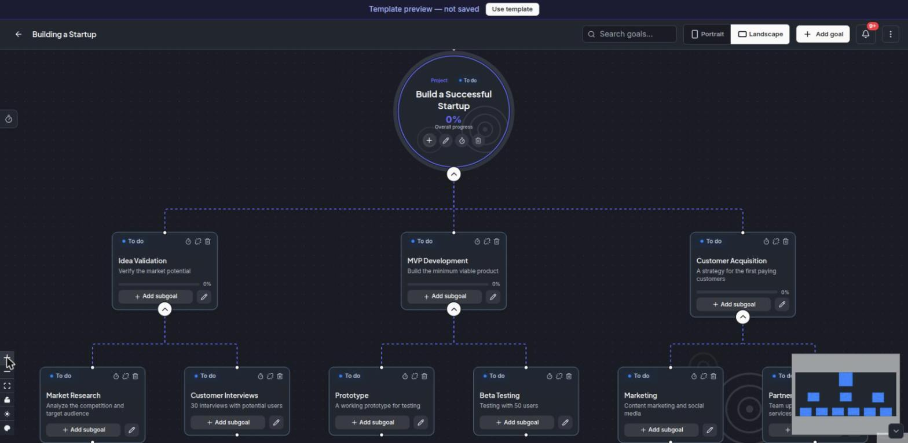
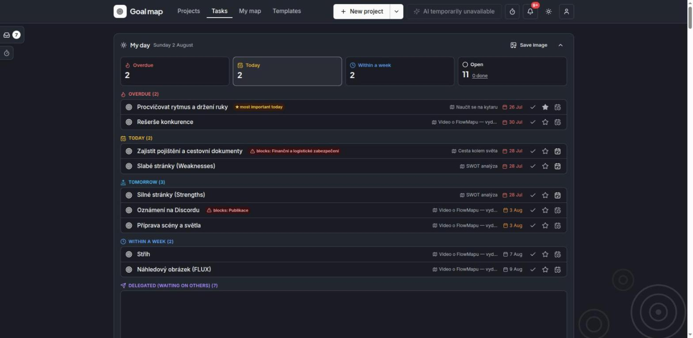
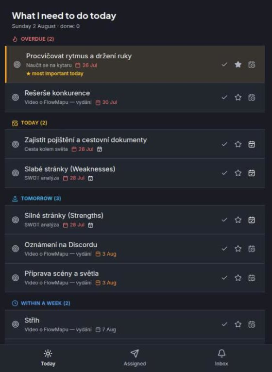
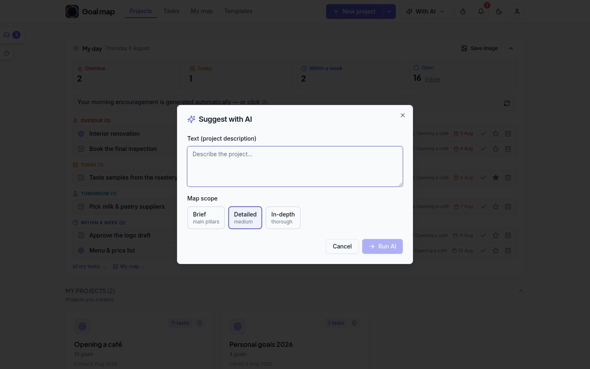
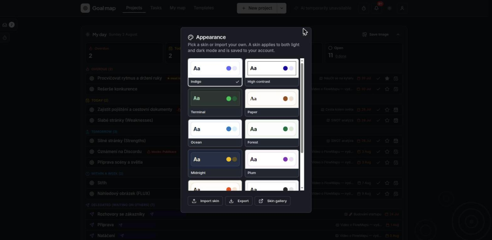

<p align="center">
  
</p>

<h1 align="center">killBottleneck</h1>

<p align="center">
  <strong>English</strong> | <a href="./README.cs.md">Čeština</a><br>
  <a href="https://killbottleneck.com">Website</a> ·
  <a href="https://killbottleneck.com/guide/what-it-is">Documentation</a> ·
  <a href="./CHANGELOG.md">Changelog</a> ·
  <a href="#license--fair-code">Licence</a>
</p>

> 🧪 **Public beta.** killBottleneck is feature-complete and in beta — the cloud
> and the self-hosted version alike; it is one and the same app. What we are
> testing here is the **self-hosted** side: installation, reverse proxies, your
> own SMTP, upgrades. Install it (Quick start below), try to break it, and
> tell us what happened: bugs → [Issues](../../issues), ideas → Discussions.
> v1.0 ships when the beta goes quiet.

A visual picture of your projects, your company and its processes — goal maps that people and AI agents work on together, **entirely on your own server: your data never leaves the company**. Open in the spirit of open source, just without the right to resell it as a hosted service — see [License](#license--fair-code).



**Nothing here phones home.** On a default install the server sends no request anywhere, and
the app loads nothing from a third-party CDN — fonts included, they are served from your own
instance. Everything that could leave your network is something **you** switch on:

| Outbound request | When it happens | Turn it off |
| --- | --- | --- |
| GitHub Releases API | Version check, from the **user's browser** — not the server | `KB_UPDATE_CHECK=0` |
| The AI endpoint you configured | Only with `KB_AI_PROVIDER` ≠ `none`; your own Ollama or any endpoint you choose | `KB_AI_PROVIDER=none` (default) |
| Google (sign-in, Drive picker) | Only when you configure `KB_GOOGLE_*` | leave those empty (default) |

There is no telemetry, no analytics and no licence check.

<details>
<summary><strong>Contents</strong> — this README is the full reference; the short version is on <a href="https://killbottleneck.com/guide/quick-start">the website</a>.</summary>

- [Quick start](#quick-start)
- [What it does without AI](#what-it-does-without-ai) · [On a phone](#on-a-phone)
- [AI features (optional)](#ai-features-optional)
- [AI assistant over MCP](#ai-assistant-over-mcp-claude-desktop-claude-code-)
- [Who performs a step: a person, or an automation](#who-performs-a-step-a-person-or-an-automation) — includes the **webhook contract** for your own agents
- [Moving a project elsewhere (JSON export/import)](#moving-a-project-elsewhere-json-export-and-import)
- [Appearance (skins)](#appearance-skins) · [Notifications](#notifications) · [Time zone and recurring templates](#time-zone-and-recurring-templates)
- [Data and backup](#data-and-backup) · [Team](#team) · [Registration and the registration key](#registration-and-the-registration-key)
- [Sign in with Google](#sign-in-with-google-optional) · [Attachments](#attachments-on-goals-a-file-or-a-link) · [E-mail (SMTP)](#e-mail-smtp-optional)
- [HTTPS (access from outside)](#https-access-from-outside) · [Updating](#updating)
- [License — fair-code](#license--fair-code) · [Contact](#contact)

</details>

## Quick start

All you need is Docker. Then:

```bash
cp .env.example .env    # optional — the defaults are fine
docker compose up -d
```

killBottleneck runs at `http://SERVER-IP:8090`. Colleagues on the local network just open it in a browser.

**The first user to register automatically becomes the administrator.** Everyone else can
register themselves, or the administrator invites them from Administration (this creates an
account with a temporary password to hand over).

## What it does without AI

A full goal map editor (nodes, edges, statuses, notes), multiple maps per user, comments on
goals, sharing maps with colleagues (read / edit), public maps, export to image/PDF.



**The “My day” panel** (both the home page and the Tasks page): a clickable overview of
overdue / today / within a week / blocking others, computed live from your data; name days
next to the date; a portrait PNG export for mobile — both full (with task names) and
**anonymous** (names redacted, for social media). Over HTTPS you also get **Share…**
(your phone's native Web Share dialog, no third-party service involved).

**Time tracking**: a ⏱ timer in the top bar (one click starts an “empty” measurement — the
project/client/goal is assigned while it runs or afterwards), a timer on every task and every
goal in a map (measuring **never changes a status** — it is purely supplementary), a left-hand
“Time tracking” panel with the records (from–to, retroactive assignment), a “Time worked”
dialog in the user menu (today/this week, broken down by project and client), a **client**
registry (project→client, so time adds up per client too), and auto-stop for forgotten timers
after 12 h. **Inbox behaviour:** an unassigned measurement stopped with a note (e.g. “call with
the client”) also saves itself as an idea in your stash.

### On a phone



The same instance, opened on a phone, switches to a **simplified view**: today's tasks,
tick them off, add one, and read messages — no map canvas to fight with on a small screen.
You can switch back to the full view at any time, and the app can be added to the home
screen (over HTTPS) so it behaves like a native one.

More in the [Simplified view guide](https://killbottleneck.com/features/lite-view).

<br clear="right">

## AI features (optional)



The AI advisor (draft a map from a goal, expand branches, chat about a map, AI project summary,
suggest tasks from a goal, a map from text/voice) is switched on in `.env` via `KB_AI_PROVIDER`:

- `openai` — **any OpenAI-compatible API**: OpenAI, OpenRouter, Groq, Mistral, Together,
  or your own vLLM / LM Studio / llama.cpp / liteLLM proxy. Set
  `KB_AI_URL=https://openrouter.ai/api/v1` (the base address, usually ending in `/v1`),
  `KB_AI_TOKEN=<your API key>` and `KB_AI_MODEL=<exact model name>`. Dictation works
  through the same service; your provider bills you for the requests.
- `api` — a remote AI service compatible with the killBottleneck API contract: enter the
  address and token you got from your provider. No GPU of your own and no maintenance.
- `ollama` — **your own local model**: install [Ollama](https://ollama.com), pull a model
  (`ollama pull gpt-oss:20b`) and set
  `KB_AI_URL=http://IP:11434` + `KB_AI_MODEL=gpt-oss:20b`.
  Everything runs on your side, no data leaves your network. (Basic prompts; voice
  transcription is not included.)
- `custom` — your own endpoint honouring the same API contract
  ([the contract is written down here](https://killbottleneck.com/reference/custom-ai-endpoint)).

When AI is used, map data is sent to the endpoint you chose; with `none` (the default) nothing
ever leaves your server.

**Daily AI encouragement** (a line in the My day panel): 1–2 sentences prioritising “what
blocks others → overdue → today”, with the occasional proverb. It is generated in the morning
by a cron job (`KB_SUMMARY_HOUR`, default 6) only for accounts that signed in within the last
`KB_SUMMARY_ACTIVE_DAYS` days (default 14, 0 = everyone); for the rest it is generated when
they open the app. Optionally a separate (smaller/faster) model just for the summaries:
`KB_SUMMARY_PROVIDER/URL/MODEL/TOKEN` — without them the general AI configuration above is
used. The panel works in full without AI, just without this one line. The AI never enumerates
task lists (those are computed from your data and clickable) and task names are sanitised
before they go into the prompt.

## AI assistant over MCP (Claude Desktop, Claude Code, …)

killBottleneck ships with a built-in **MCP server** (`mcp/`): connect your AI assistant to your
own instance and maps get built conversationally — “make a map out of these meeting notes”,
bulk edits, ticking off what's done. It works the same for self-hosted and hosted instances,
only the address differs.

1. In the app: user menu → **API keys** → a new key with the **Read and write** scope
   (**Read only** is enough for read access). The token is shown only once. Recommended: give
   the key an expiry and revoke it once you stop using it.
2. Nothing to install — the server is on npm as
   [`killbottleneck-mcp`](https://www.npmjs.com/package/killbottleneck-mcp), so `npx` fetches
   it on first use. (Prefer running it from this repository? `cd mcp && npm install` and use
   `node /absolute/path/mcp/index.js` instead of the `npx` command below.)
3. Register it with your assistant:

   **Claude Code:**
   ```bash
   claude mcp add killbottleneck \
     -e KB_URL=http://SERVER-IP:8090 \
     -e KB_API_KEY=kb_user_... \
     -- npx -y killbottleneck-mcp
   ```

   **Claude Desktop** (`claude_desktop_config.json` → `mcpServers`):
   ```json
   {
     "mcpServers": {
       "killbottleneck": {
         "command": "npx",
         "args": ["-y", "killbottleneck-mcp"],
         "env": {
           "KB_URL": "http://SERVER-IP:8090",
           "KB_API_KEY": "kb_user_..."
         }
       }
     }
   }
   ```

Tools: `list_maps`, `get_map`, `create_map`, `add_nodes`, `update_node`, `delete_node`
(plus rule tools). A goal with an assignee or a deadline IS a task — there are no
separate task records.

**Security:** a key gives access to its owner's maps (exactly as in the app); shared and team MAPS are deliberately not reachable through a
key (for now), and administration, AI settings and users never are. Writes can add/edit/delete
goals and tasks; **a whole map cannot be deleted through the API**, and neither can the apex of
a map. Limits: 120 reads + 30 writes per minute per key, at most 200 nodes per call, at most 20
keys per account. Working alongside an open editor is handled by conflict detection (the editor
offers to reload, the assistant reloads the map itself). Note: `add_nodes` re-runs the layout
of the whole map. MCP tool output is in English (assistants always understand it); server error
messages arrive in the language of your account.

## Who performs a step: a person, or an automation

For every goal in a map you can say whether a **person** or an **automation** does it. Whether
there is an AI agent or a scheduled cron job behind that automation is not your problem —
whoever builds it knows.

Important: **the responsible person for a goal is always a human.** Even for an automated step
there is someone accountable, who gets the notifications and whose “My day” the goal counts
towards. The automation does the work; a person is answerable for it.

For an automated step you also record **which automation does it** — this is a record of how
things are today (“n8n already does this step for us”), not a command. That is what makes it
visible at a glance which parts of the map are done by people and which by machines.

### “I would like this automated”

On any goal you can tick **a request to have the step automated**, and optionally add a
sentence explaining why. The request goes to the **AI agent manager** — a separate flag on a
user (User management → *AI manager*), independent of their role; both an administrator and an
ordinary member can hold it alongside their role.

Once the manager builds the automation and records it on the goal, **the request tidies itself
away and the requester gets a message** that their goal is now automated. The full cycle:

```
person: ☑ I would like this automated  ("I upload subtitles by hand, 20 minutes")
   ↓
the AI manager gets a notification → decides → builds an n8n workflow
   ↓
the manager records it on the goal: "n8n — subtitle translation"
   ↓
the requester gets a notification: "your goal is now automated by n8n — subtitle translation"
```

### Attachments on a goal

You can upload files to any goal. On a goal with an automation, **uploading a file starts it
right away** — instead of filling in a form somewhere else you simply attach whatever needs
processing (typically subtitles, source material, an export).

Attachments are visible only to people with access to the project. The files are protected: the
link alone gives nothing away.

### AI agent registry

The AI agent manager (or an administrator) maintains a directory of automations under **AI
agent registry**: name, webhook address, signing secret, enabled/disabled. On a goal the
automation is picked **by name** — team members never see the address or the secret. When the
name on a goal matches an agent in the registry, killBottleneck can start it itself.

**Who may start it.** Each agent can carry a list of allowed e-mail addresses. An empty list
means the automation can be started by **anyone who can edit any map** — inside a company that
is usually fine, but restrict it on an instance you let contractors into: whoever may edit a
map can otherwise start any of your n8n workflows and feed their own text into it (the goal's
title and description go to the agent in the payload).

Attachments are capped at 200 files per project, plus an optional space limit for the WHOLE
instance (`KB_FILES_MB` in MB; `0` = uploads disabled entirely, empty = no limit — set one on a
shared disk so a hosted instance cannot fill it up). ⚠️ The former `FLOWMAP_MAP_FILES_MB` was a
PER-PROJECT quota defaulting to 200 MB — if you have it set it still applies to you, but
without it there is now NO space limit at all.

### An automated run: killBottleneck → n8n → back

An automation starts when:

- an **attachment is uploaded** to the goal, **or**
- the goal's **turn comes** — it was waiting for its sub-goals and they have all just been
  completed, **or**
- somebody manually switches the goal to “in progress” (this is also how you **retry a failed
  run**)

A running automation will not be started a second time until it reports back or expires.

**The outgoing request** (POST to the agent's address, with an `X-Signature` header =
HMAC-SHA256 of the entire body using the agent's secret):

```json
{
  "run_id": "…", "run_token": "kbr_…",
  "callback_url": "https://your-instance/api/kb/agent-callback",
  "files_url": "https://your-instance/api/kb/agent-files?run_token=kbr_…",
  "files": [{ "id": "…", "name": "subtitles.sbv", "size": 1234, "url": "https://…?run_token=kbr_…" }],
  "map_id": "…", "map_title": "…",
  "node_id": "…", "node_title": "…",
  "description": "…", "deadline": "2026-08-01",
  "owner": "responsible@company.com", "triggered_by": "who@company.com"
}
```

The agent downloads files using its run token; `files_url` is a **live listing**, so it also
sees attachments added while it is running. The token expires once the result is reported.

**Reporting back** (POST to `callback_url`, no login — the run token authenticates it):

```json
{ "run_id": "…", "run_token": "kbr_…", "status": "done", "result": "Translated into 3 languages" }
```

`status` is `done` or `failed`. A token is valid **for one goal and one report** — a second
call with the same token will not go through.

After `done` the goal is **completed**, and that sets the rest of the process in motion: the
following goal is unblocked and the person responsible for it is notified that they can start.
If that following goal is automated as well, it starts straight away — so the steps chain
themselves.

**Set the address the agent should call back on.** `callback_url` is assembled by the server,
not the browser — without configuration it uses PocketBase's “Application URL”, which after
installation is `http://localhost:8090`. An agent running on another machine would therefore
call itself, and the run would hang until it timed out. In `.env`:

```env
KB_PUBLIC_URL=https://killbottleneck.yourcompany.com
KB_AGENT_TIMEOUT_MIN=90
```

Any address the agent can reach will do — on a self-hosted setup `http://192.168.1.10:8090` on
the LAN is perfectly fine. Hosted instances (killBottleneck Cloud) have this set automatically.

**Is your n8n on the same network?** The webhook address is called by the server, which makes
it a classic internal-network scanning vector — so by default killBottleneck **refuses to call
private addresses** (`10.x`, `192.168.x`, `172.16–31.x`, `localhost`, cloud metadata). On a
self-hosted setup where n8n runs next to killBottleneck, allow it:

```env
KB_ALLOW_PRIVATE_WEBHOOKS=1
```

Without this the run is marked failed and the AI agent manager gets a message explaining why.
**An agent must have its secret filled in** — without one the request would be signed with an
empty key and the recipient would have no protection whatsoever, so killBottleneck rejects such
a run outright. The currently effective address is always shown at the bottom of the **AI agent
registry**, which warns you when it points at localhost. **This only concerns automations** — if
you do not use them, you do not need to set this variable.

### When an automation does not finish

The state of a run is visible **right in the goal's dialog** — pending / running / done /
failed, with the reason on failure. A run is restarted by switching the goal back to “In
progress”.

What each state means:

| State | What is happening |
|---|---|
| pending | the run is queued and goes out within a minute (a single map save sends at most a handful of webhooks, so nobody is left waiting) |
| running | the agent has picked up the work and has not reported back yet |
| done / failed | the agent reported a result, or the run expired |

A run that does not report back within `KB_AGENT_TIMEOUT_MIN` (default 90) minutes is marked
failed by a watchdog, which notifies both the responsible person and the AI agent managers — so
a goal never hangs silently.

The most common causes of failure: the agent is not in the registry or is disabled; it has no
secret; its address points into a private network and `KB_ALLOW_PRIVATE_WEBHOOKS=1` is missing;
or the webhook is unreachable. The details (including connection errors) are in the server log —
`docker compose logs killbottleneck` — they are deliberately not surfaced in the app.

## Moving a project elsewhere (JSON export and import)

A project can be exported to a `.json` file and imported somewhere else — between colleagues
and between instances. In the editor: **Export → Export JSON**, choosing **with names** or
**without names**. Import lives in the menu next to the “New project” button.

What the file contains: the title, the description, the whole goal structure (including
statuses, deadlines, who performs each step and automation requests) and the tasks attached to
it. The “without names” option clears both the responsible people and the assignees — the names
of automations stay, since they describe the process.

**Switching from Asana or Trello:** the same import also accepts an **Asana project export
(CSV)** and a **Trello board export (JSON)**. Sections/lists become map branches, tasks/cards
become goals, subtasks and checklists become child goals; statuses (done), due dates,
descriptions and — for Asana — assignees carry over (e-mails unknown to this instance are
cleared and counted). Everything is converted locally in the browser — nothing calls Asana or
Trello. Limit: 400 items per file.

What is **not** transferred: attachments, comments, sharing, archiving and numbering series. An
import always creates a **new** project owned by whoever imports it, regenerates the goal
identifiers (so it does not collide with the original) and **shares nothing with anybody and
sends no notifications** — you have to share the project manually to collaborate on it.
Assignments to e-mail addresses that do not exist on this instance are dropped, and the import
tells you how many.

## Appearance (skins)



In the avatar menu → **Appearance** everyone picks a skin: Indigo (default),
High contrast, Terminal or Paper. The choice is saved to the account, so it
applies on every device, in both light and dark mode, and in the simplified
lite view too (the picker there sits in the footer).

**Custom skins:** a skin is a small JSON file (`kb-skin` v1 format) — a set of
colors (HSL), fonts and corner radius. The Appearance dialog can **export** the
current skin (for a built-in, its definition — "take it and tweak it") and
**import** someone else's, from a file or by pasting. By design it is **not**
arbitrary CSS: values pass a whitelist on both the client and the server, so a
shared skin cannot run or send anything. No web fonts are ever downloaded —
only fonts bundled with the app and system fonts are used; an unknown font
harmlessly falls back to the next one in the stack.

**Company look:** an administrator sets the instance-wide default skin in the
organization admin — it applies to everyone who has not picked their own,
including the login screen. A user's own choice always takes precedence.

What a skin does **not** change in v1 (by design): status colors (red/amber/green
= overdue/in progress/done stay readable everywhere the same). **Map export
(PNG/PDF) is true to the screen** — captured in the active skin and light/dark
mode, including the background color; only the backdrop artwork is left out.
The project dashboard PDF and the "My day" image deliberately stay light so
they can be sent to anyone.

Community skins and the **open source skin editor**:
<https://github.com/tengolabs/killbottleneck-skins> — skins are free data (CC0), the
editor is MIT. Try the editor right in your browser, nothing to install:
<https://tengolabs.github.io/killbottleneck-skins/>.

## Notifications

The bell in the header shows the last 20 events; the full list with filters and paging is at
`/notifications`. That is also where **notification settings** live, so everyone can switch
individual types on or off.

Notifications are sent for: a task or a goal being assigned to you (including in a map that
already exists), a comment on a task or a goal, a project being shared with you, a waiting goal
being unblocked, an approaching or missed deadline (one digest per day, not one per item), an
automation request and its fulfilment, an automation finishing or failing, and a timer being
stopped automatically.

Deadline reminders are sent in the morning; set the hour with `KB_DEADLINE_HOUR` (default 7,
the container's local time). Notifications you have read are cleaned up after 30 days.

The e-mail channel is ready but only switches on once SMTP is configured (see below) — until
then it is greyed out in the settings.

## Time zone and recurring templates

A template can be set up so that a project is created from it **automatically** (e.g. “every
Monday” or “on the Nth day of the month”). For “Monday” and the time of creation to match your
local time, set this in `.env`:

```bash
TZ=Europe/Prague     # your time zone (empty = UTC)
KB_AUTO_HOUR=5  # the hour (0–23) from which projects are created on a given day
```

- If the server slept through that hour (it was switched off), the project is created at the
  next later hour of the same day — it is not skipped.
- The zone applies **to the whole instance** — for a team spread across zones the server's zone
  is used, not each user's.
- Recurring **tasks** (moving the deadline on completion) deliberately compute in UTC, so
  crossing midnight or a daylight-saving change does not shift them by a day.

## Data and backup

All data lives in the `./pb_data` folder (SQLite + uploaded files). Use the bundled script to
back it up:

```bash
./backup.sh                 # creates kb-backup-YYYY-MM-DD.tgz
./backup.sh restore FILE    # restores data from a backup
```

(By hand: to back up, copy the `pb_data` folder; to restore, put it back.)

## Team

One instance = one team. Roles: **Administrator** (manages users and roles, organization
settings — name and logo), **Manager** (invites members, sees and manages all tasks), **Member**
(their own tasks and shared maps). You can invite people from Administration or straight from
the Tasks page.

## Registration and the registration key

The first account to register becomes the **administrator**. If the instance is reachable from
the internet, set `KB_SETUP_CODE` in `.env` — every registration then requires that key, so not
just anyone who knows the address can create an account. Hand the key out to the people you
want to let in; on top of that an administrator can invite users directly (an invitation does
not need the key). Empty = registration without a key.

## Sign in with Google (optional)

Users can sign in with Google instead of e-mail and password. To set it up:

1. In the [Google Cloud Console](https://console.cloud.google.com/) go to **APIs & Services**
   → **Credentials** → **Create credentials** → **OAuth client ID** → type **Web application**.
2. Under **Authorized redirect URIs** add: `https://YOUR-DOMAIN/api/oauth2-redirect`
3. Copy the **Client ID** and **Client secret** into `.env`:
   ```
   KB_GOOGLE_CLIENT_ID=…apps.googleusercontent.com
   KB_GOOGLE_CLIENT_SECRET=…
   ```
4. `docker compose up -d` — the “Sign in with Google” button appears by itself.

Empty variables = Google sign-in is off (the button is not shown). On an instance with a
**registration key**, Google sign-in is only for existing users — a new account cannot be
created through Google (there is no way to enter the key), so the account has to be created
with the key first.

## Attachments on goals: a file, or a link

You can pin either an **uploaded file** or a **link** (Drive, OneDrive, SharePoint, a specific
e-mail, anything on `https://`) to any goal. A link has three advantages: it takes up no space,
the team always opens **the current version**, and the file stays where you keep it.

How much space uploaded files may take is governed by `KB_FILES_MB` — it applies to the **whole
instance**, not per project:

| Value | Behaviour |
|---|---|
| empty | no limit (the default for self-hosting — it is your disk) |
| a number | the cap in MB, e.g. `5000` = 5 GB |
| `0` | uploads disabled, attachments as links only |

Hosted instances run with `0`: that way the provider does not hold your documents, only links
to them. A link has to start with `http://` or `https://` — a network drive path
(`\\server\folder`) will not open from a browser for security reasons, so that belongs in the
description.

## E-mail (SMTP, optional)

SMTP is configured in the PocketBase admin UI: `http://SERVER-IP:8090/_/` → Settings → Mail
settings (the superuser account is created on first start — you will find the link in
`docker compose logs`). With SMTP configured:

- an invitation to a new user is sent by e-mail (with a link to set a password) — without SMTP
  the administrator is shown a temporary password to hand over manually,
- self-service password reset works.

## HTTPS (access from outside)

killBottleneck itself runs over HTTP — to reach it from outside your LAN, use a VPN or a reverse
proxy. An example with [Caddy](https://caddyserver.com) (automatic HTTPS certificates):

```
# Caddyfile
killbottleneck.your-domain.com {
    reverse_proxy 127.0.0.1:8090
}
```

Add it to compose through `docker-compose.override.yml` (that file is not overwritten by
updates):

```yaml
services:
  caddy:
    image: caddy:2
    ports: ["80:80", "443:443"]
    volumes:
      - ./Caddyfile:/etc/caddy/Caddyfile
      - caddy_data:/data
volumes:
  caddy_data:
```

HTTPS additionally unlocks **Share…** for the “My day” image (the Web Share API — your phone's
native share dialog, no third-party service) and **adding the app to your phone's home screen**
(a service worker only runs in a secure context). Browsers do not allow either of these over
plain HTTP; on an HTTPS domain they appear by themselves, with no configuration.

### Turn on compression in your proxy — it is a threefold saving

killBottleneck does not compress responses itself (there is no way to enable it safely in
PocketBase without breaking how the API behaves when it rejects an oversized body). The main
frontend file is **488 kB uncompressed and 157 kB gzipped** — on mobile data that is the
difference you notice most when opening it for the first time. One line is enough:

```
# Caddyfile
killbottleneck.your-domain.com {
    encode gzip zstd
    reverse_proxy 127.0.0.1:8090
}
```

(In nginx: `gzip on; gzip_types application/javascript text/css;`. Behind Cloudflare or a
similar service it happens on its own — there is nothing to configure.)

## Updating

```bash
git pull            # or download the new version
docker compose up -d --build
```

Database migrations run automatically on start. Before a bigger update it is worth taking a
backup (`./backup.sh`).

> Always with `--build`: the app and its server-side logic are baked into the image, so after
> every update (a code change, `.env` variables such as `TZ`) you need
> `docker compose up -d --build`, not just `restart`.

**One-off, when updating from a version up to v0.11:** after the product was renamed the
container is called `killbottleneck` instead of `flowmap`. The old container holds port 8090,
so the new one would not come up — stop and remove it first:

```bash
docker rm -f flowmap
docker compose up -d --build
```

Your data is in the `./pb_data` folder on disk, not in the container — you will not lose
anything. `FLOWMAP_*` variables in your `.env` keep working, there is no need to rewrite them.

## Notes

- A public link to a map shares only the map canvas — tasks and task comments are not visible
  through it.
- Licence: **fair-code** — Sustainable Use License (see the License section below).

## License — fair-code

killBottleneck isn't "open source" in the strict (OSI) sense — and we say so plainly. It's
**fair-code**: the source is public, you can download it, run it, modify it and use it, and
for the vast majority of people it delivers the same benefits as classic open source.
The parts that *can* be classic **open source, are**: the
[skin editor](https://tengolabs.github.io/killbottleneck-skins/) (MIT) and the whole
[skin gallery](https://github.com/tengolabs/killbottleneck-skins) including its validator (CC0).

**You get the whole of killBottleneck — every feature, including team collaboration and the AI
features.** No stripped-down "free version", nothing locked behind a paywall. You can even
**power the AI yourself, for free** — with your own model (Ollama) on your machine, or your
own API key. Our hosted cloud (AI included) is offered only as **a convenience for those who have
nowhere to run killBottleneck** — it's convenience, not a condition.

**What you may do with killBottleneck — free and with no catch:**
- Run it yourself on your own computer or server — **your data stays with you**.
- Use it in your company for your own work and your team — fully.
- Plug in **your own AI** (a local model or your own API key), or use no AI at all.
- Modify it however you need.
- Offer services around killBottleneck (setup, consulting, customizations for a client).

**What we keep for ourselves — and what keeps killBottleneck alive:**
- Hosting killBottleneck and charging people for access.
- White-labeling it — releasing it under someone else's brand.
- Reselling it as a paid service.

That's our business — it's what lets us keep adding features, fixing bugs, and keeping
killBottleneck alive. **We actively encourage you to build on killBottleneck** and use it however you need;
just don't turn it into a competing hosted service. Full terms: [LICENSE](./LICENSE).
Third-party components keep their original licenses (MIT, Apache-2.0, BSD, …) — the full
list with license texts is in [THIRD-PARTY-LICENSES.md](./THIRD-PARTY-LICENSES.md).

**Rights holder:** Tengo, s.r.o., ID No. 03339165, Dolní Valy 205, 262 72 Březnice, Czech Republic.
Want to host killBottleneck as a service, ship it under your own brand, or resell it? The license doesn't allow that — but **a commercial license is available**, write to [licence@killbottleneck.com](mailto:licence@killbottleneck.com).

*Česká verze této sekce je v [README.cs.md](./README.cs.md#licence--fair-code).*

Built by **Richard Pobrislo** ([LinkedIn](https://www.linkedin.com/in/richard-pobrislo), [Ctrl+Alt+AI](https://www.youtube.com/@ctrlaltaicz)) — one person, which is why the support channels below are what they are.

The code is **written 100% by AI** — Claude Fable 5, Claude Opus 5 and Claude Opus 4.8 — under human direction. Every release goes through an automated regression suite and a manual click-through before it ships; the release notes list what was verified and what deliberately wasn't.

## Contact

| Where | What for |
|---|---|
| **GitHub Issues / Discussions** | bugs and ideas for improvements — in the open, so others can see them too |
| **security@killbottleneck.com** | security issues (**not** in a public issue) — see [SECURITY.md](./SECURITY.md) |
| **support@killbottleneck.com** | paid plans: the hosted instance |
| **licence@killbottleneck.com** | commercial licensing — hosting as a service, white-label, reselling |
| **info@killbottleneck.com** | everything else |

We do not accept code from outside contributors (see [CONTRIBUTING.md](./CONTRIBUTING.md)) —
ideas and bug reports we do, and they are welcome.

## Supporting the project

killBottleneck is **fair-code** — the whole product (every feature) is free to self-host and
will stay that way. If it helps you:

- follow our [YouTube channel](https://www.youtube.com/@ctrlaltaicz) with tutorials and AI news,
- join us on [Discord](https://discord.gg/dkxMdVKwXw).
